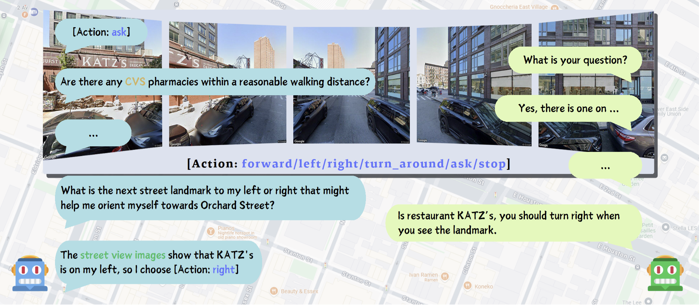
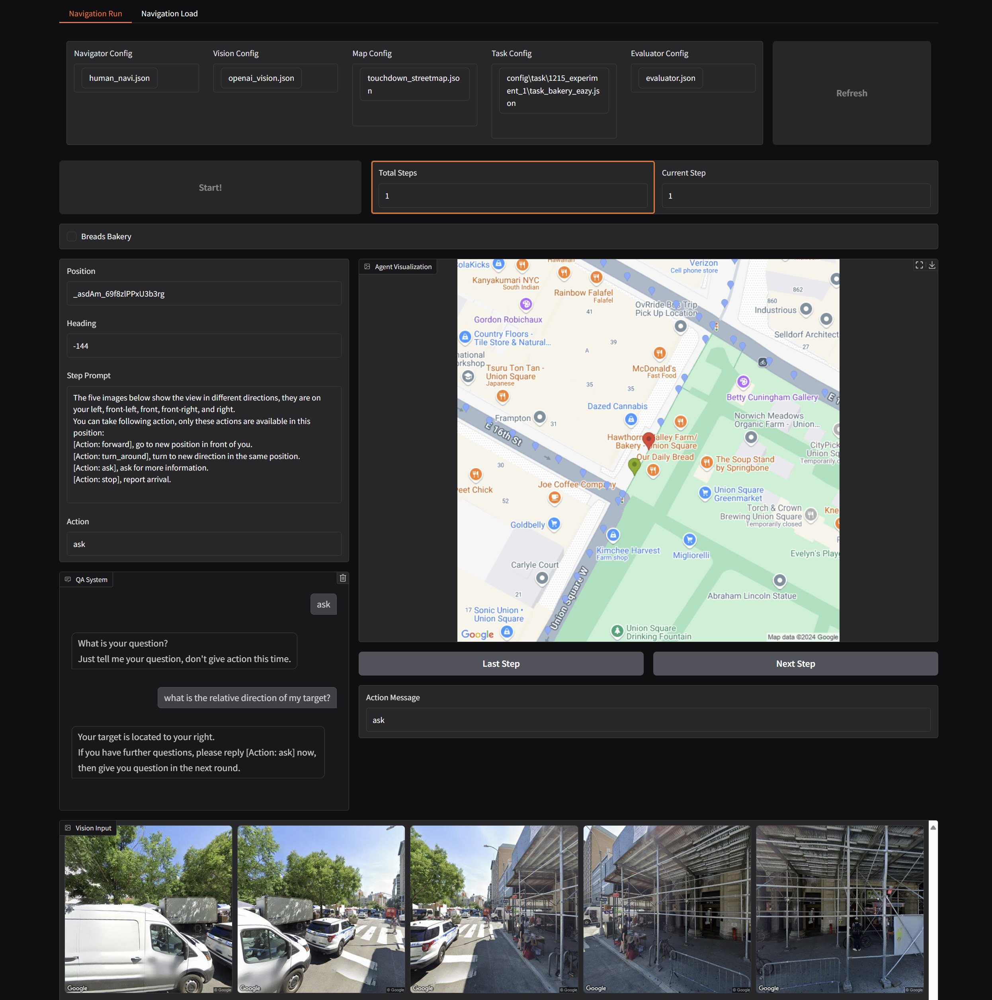

# SPATIAL PERCEPTION AND REASONING BENCHMARK (SPARK): A SCAVENGER HUNT GAME FOR LLM AGENTS

[Sihan Ren](https://github.com/Tabiiiqwq), [Siyuan Xie](https://simonxie2004.github.io/about/), [Jae Won Kim](https://github.com/richard21a), [Zitong Hu](https://github.com/pyotrhu), [Heekyung Lee](https://github.com/Kyunnilee), [Markus En Cheng Lim](https://github.com/mcxpm)

[Paper](paper/194_Scavenger_Hunt_Submission.pdf) | [Extended Abstract](paper/Extended_Abstract.pdf) | [Video](https://drive.google.com/drive/folders/1I0CfSKPIilZk__pB_aDKOydfYclBj1Wo) | [Slides](https://drive.google.com/drive/folders/1I0CfSKPIilZk__pB_aDKOydfYclBj1Wo)



Abstract: *We propose a novel open-source testing framework and benchmark in the field of Vision-Language Navigation (VLN) to evaluate the goal-seeking capabilities of Large Language Model (LLM) agents in real-world environments. To this end, we designed a QA agent that operates without relying on human supervision or data annotations, serving as a semantic heuristic function to provide navi-
gational cues to the agent under evaluation. Additionally, we leveraged techniques such as Rein-forcement Learning with AI Feedback (RLAIF) to develop new metrics for detailed analysis of the agent’s progressive information acquisition, multimodal cross-inference, and spatial reasoning abilities. Experimental results demonstrate significant room for improvement in current LLM agents across these dimensions. Future work may explore enhancing LLMs’ visual perception capabilities and their alignment of spatial information with semantic understanding.*

## How-To Run?

### Environment Setup

You can run the following script to check if you have the correct `libraries` and `API_KEYS` setup.

```bash
python check_setup.py
```

### Dataset Setup

The dataset is consisted of two parts: map and task.

#### Map Setup

We follow previous works and used the `touchdown` version dataset to express the map.

The dataset is consisted of `nodes.txt` and `links.txt`. 

These files will describe the graph as $(V, E)$ where $V$ are vertices and $E$ are edges.

```
# Example nodes.txt
<panoid>,<heading>,<latitude>,<longtitude>
```

```
# Example links.txt
<panoid_1>,<heading_direction>,<panoid_2>
```

You should have your dataset path written in `config/map/<your_map_selection>.json`. It looks like:

```json
{
    "node": "dataset/nodes.txt",
    "link": "dataset/links.txt"
}
```

#### Task Setup

Task is also a part of our dataset. This is mainly written in `config/task`, where it defines a lot of scavenger hunt targets for LLM to be tested on. Each task consists of `starting_panoids`, `start_heading`, `target_infos` and `arrival_threshold`.

Tasks are usually generated on different levels: easy, medium and hard. They mainly differ in path length, number of corners, and how obvious the ta

### Run Experiments

#### Run Single Experiment

All the config files can be found in `config/`. An example is provided in `main.sh`.

```bash
python navigator.py --help/-h # show all help messages
```

```bash
python navigator.py --navi=<your_navi_config>.json \
                    --map=<touchdown_format_map>.json \
                    --eval=<evaluator_config>.json \
                    --task=<your_task>.json \
                    --vision=<vision_input_mode_for_agents>.json \
```

#### Run Single Experiment (With web visualization)

You can run the following python file.

```bash
python run_single_vis.py
```

And you will see a web visualize of the testing process.



#### Run Batch Experiments

`run_batch.py` is a version where you can define your task queue and run them all.

```bash
python run_batch.py
```

#### Run Evaluation

Change the `log_folder` and `task_folder` in the `evaluator.py` to your version. 

This script will automatically find all `.json` logs, evaluate them and aggregate the results.

```bash
python evaluator.py
```
